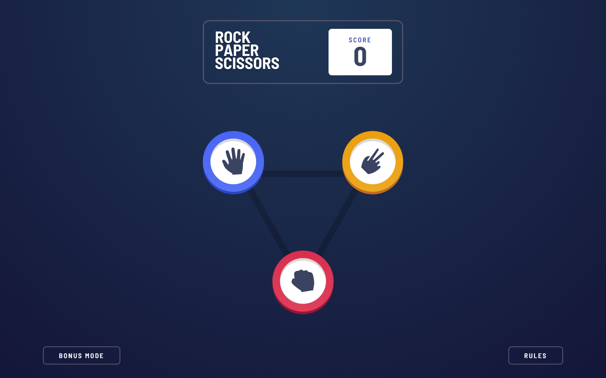
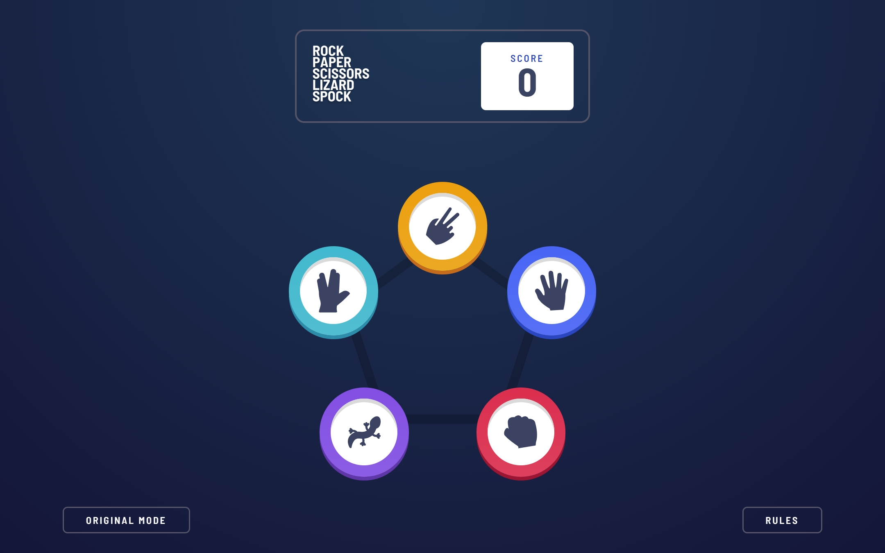
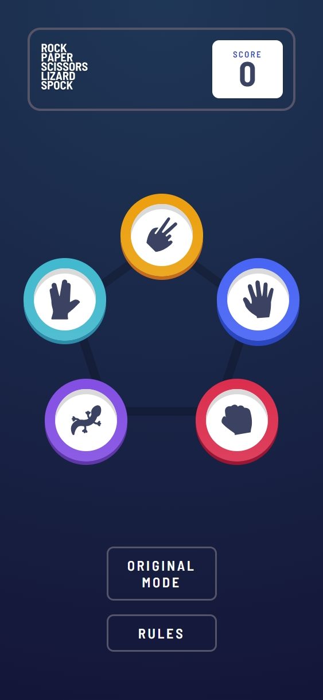
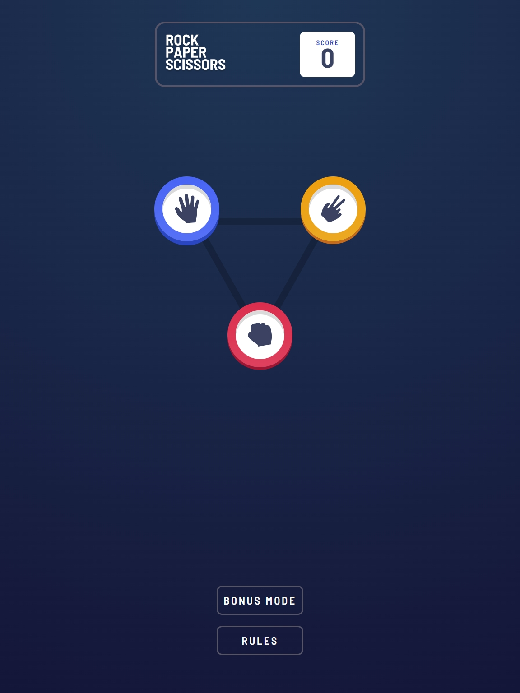
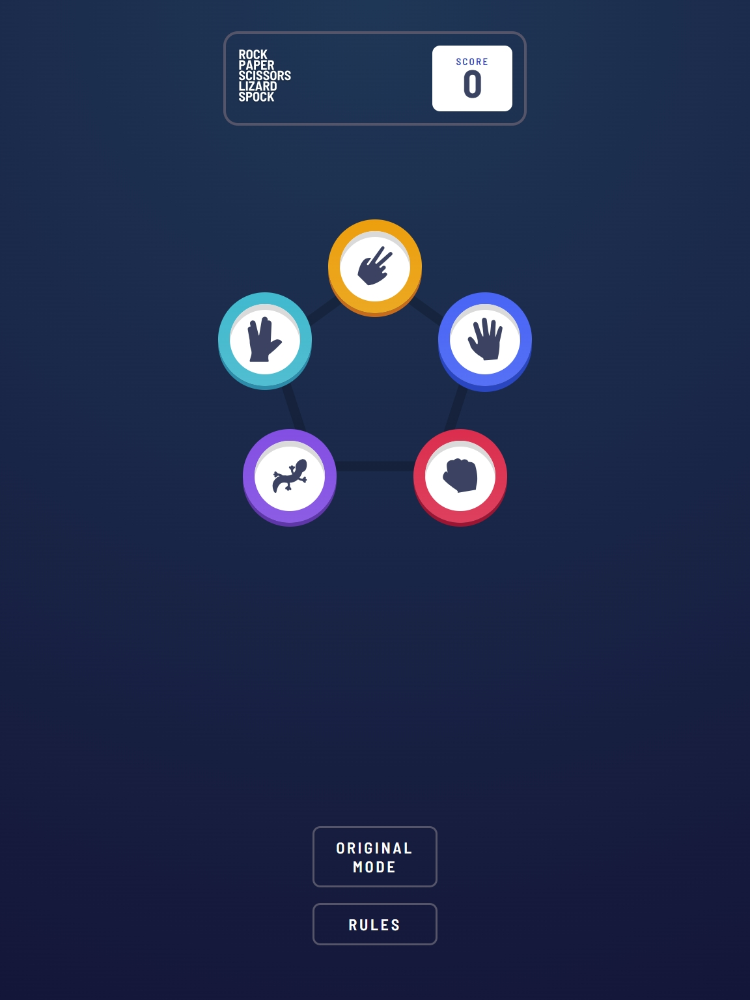

# Frontend Mentor - Rock, Paper, Scissors, Lizard, Spock solution

This is a solution to the [Rock, Paper, Scissors challenge on Frontend Mentor](https://www.frontendmentor.io/challenges/rock-paper-scissors-game-pT17_DGLX). Frontend Mentor challenges help you improve your coding skills by building realistic projects. 

## Table of contents

- [Overview](#overview)
  - [The challenge](#the-challenge)
  - [Screenshot](#screenshot)
  - [Links](#links)
- [My process](#my-process)
  - [Built with](#built-with)
  - [What I learned](#what-i-learned)
  - [Features](#features)
- [Getting Started](#getting-started)
- [Author](#author)

## Overview

This project is a fully functional, dual-mode implementation of the classic Rock Paper Scissors game, expanded to include the "Lizard Spock" variation. Beyond the standard gameplay, it features a seamless mode-switching system, persistent score tracking, and a highly responsive, pixel-perfect UI.

### The challenge

Users should be able to:

- View the optimal layout for the game depending on their device's screen size
- Play Rock, Paper, Scissors against the computer
- **Bonus**: Maintain the state of the score after refreshing the browser
- **Bonus**: Play Rock, Paper, Scissors, Lizard, Spock against the computer
- **Bonus**: Toggle between the two game modes seamlessly

### Screenshot
DESKTOP VIEWS



MOBILE VIEWS



TABLET VIEWS



### Links

- Solution URL: [Add your solution URL here](https://your-solution-url.com)
- Live Site URL: [Add your live site URL here](https://your-live-site-url.com)

## My process

### Built with

- [React](https://reactjs.org/) - JS library
- [TypeScript](https://www.typescriptlang.org/) - For static typing
- [Vite](https://vitejs.dev/) - Next Generation Frontend Tooling
- [CSS Custom Properties](https://developer.mozilla.org/en-US/docs/Web/CSS/Using_CSS_custom_properties) - For styling variables
- [Flexbox](https://developer.mozilla.org/en-US/docs/Web/CSS/CSS_Flexible_Box_Layout/Basic_Concepts_of_Flexbox) - For layout
- [Mobile-first workflow](https://developer.mozilla.org/en-US/docs/Learn/CSS/CSS_layout/Responsive_Design#mobile-first_design) - For responsive design

### What I learned

During this project, I deepened my understanding of state management in React, particularly when dealing with complex game logic and mode-switching. Implementing the pentagon layout for the "Bonus" mode was a great exercise in absolute positioning and responsive scaling.

### Features

- **Dual Game Modes**: Switch between the standard 3-choice game and the 5-choice "Lizard Spock" variation.
- **Score Persistence**: Your progress is automatically saved to browser storage.
- **Responsive Layout**: Pixel-perfect designs for both mobile and desktop views.
- **Interactive Modals**: Dynamic rules modal that adapts to the current game mode.

## Getting Started

To run this project locally:

1. Clone the repository
2. Install dependencies:
   ```bash
   npm install
   ```
3. Run the development server:
   ```bash
   npm run dev
   ```
4. Build for production:
   ```bash
   npm run build
   ```

## Author

- Frontend Mentor - [@yourusername](https://www.frontendmentor.io/profile/yourusername)
- Coded by **Mhista Fortune**
